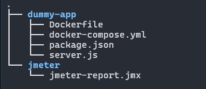

# 🧪  JMeter Performance Testing Project

This project contains performance tests designed with Apache JMeter to evaluate the stability, speed, and scalability of web services. It is ideal for validating REST APIs and simulating real loads in development or staging environments.
## 🚀 Characteristics

- Load and stress testing with multiple simultaneous users
- Execution in CLI mode for CI/CD integration
- Use of CSV files for dynamic data
- Automatic generation of HTML reports
- Integration with BlazeMeter for scenario recording

## 📁 Structure

## ⚙️ Requirements
- Java >= 8
- Apache JMeter install

## 📊  Reports

- Average response time- Error rate
- Concurrent users
- Throughput and latency
## 👨‍💻 Autor

Renzo Steven Medina Olaya
Backend Developer transitioning into DevOps

